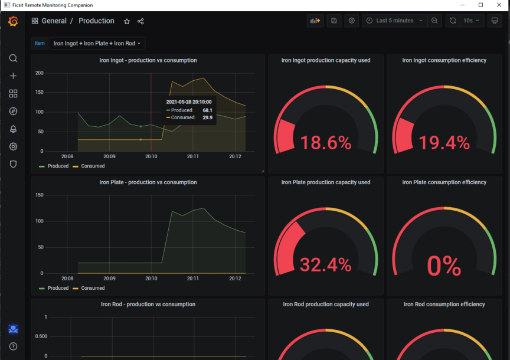
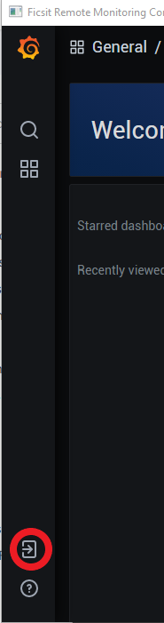
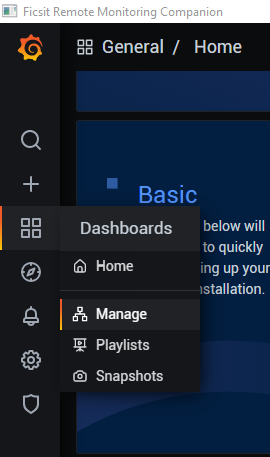
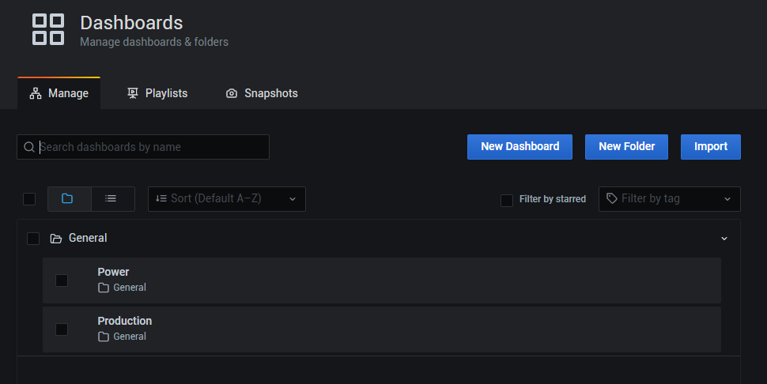

# Ficsit Remote Monitoring Companion

Ficsit Remote Monitoring Companion is a companion application for the 
[Ficsit Remote Montioring mod](https://ficsit.app/mod/B9bEiZFtaaQZHU) 
for [Satisfactory](https://www.satisfactorygame.com/).

The Ficsit Remote Monitoring mod exports metrics about the loaded save in 
Satisfactory, via a web server serving JSON. This companion application 
provides a visulisation tool on top of those metrics.

## Installation instructions
See [installation instructions](./InstallationInstructions.md)

## How do I use it?
Once installed, sign in (button in bottom left), using the username and password `ficsit:pioneer`.

Ficsit Remote Monitoring Companion comes with some preconfigured dashboards, under the Dashboards > Manage menu.

From the manage dashboards screen, you can create your own dashboards. How to do that is out of scope here, but 
[the Grafana documentation](https://grafana.com/docs/grafana/latest/) is a good place to start.

## What metrics are available

<!-- This table is generated by running `PrometheusExporter.exe -ShowMetrics` -->
<table>
    <thead>
        <tr>
            <th>Name</th>
            <th>Description</th>
            <th>Labels</th>
        </tr>
    </thead>
    <tbody>
        <tr>
            <td>power_capacity_mw</td>
            <td>Total capacity of all generators in a circuit</td>
            <td>circuit_id</td>
        </tr>
        <tr>
            <td>power_consumed_mw</td>
            <td>Amount of power being consumed in a circuit</td>
            <td>circuit_id</td>
        </tr>
        <tr>
            <td>power_max_consumed_mw</td>
            <td>Highest amount of power consumed in a circuit</td>
            <td>circuit_id</td>
        </tr>
        <tr>
            <td>power_produced_mw</td>
            <td>Amount of power being produced in a circuit</td>
            <td>circuit_id</td>
        </tr>
        <tr>
            <td>power_battery_differential_pc</td>
            <td>Amount of battery capacity as a percentage of total capacity in a circuit</td>
            <td>circuit_id</td>
        </tr>
        <tr>
            <td>power_battery_pc</td>
            <td>Amount of battery power available as a percentage of total battery capacity in a circuit</td>
            <td>circuit_id</td>
        </tr>
        <tr>
            <td>power_battery_capacity_mw</td>
            <td>Total battery capacity in a circuit</td>
            <td>circuit_id</td>
        </tr>
        <tr>
            <td>power_battery_time_empty_seconds</td>
            <td>Amount of time batteries have been empty in a circuit</td>
            <td>circuit_id</td>
        </tr>
        <tr>
            <td>power_fuse_blown</td>
            <td>Whether the fuse has been blown in a circuit</td>
            <td>circuit_id</td>
        </tr>
        <tr>
            <td>item_production_capacity_per_min</td>
            <td>The factory's capacity for the production of an item, per minute</td>
            <td>item_name</td>
        </tr>
        <tr>
            <td>item_production_capacity_pc</td>
            <td>The percentage of an item's production capacity being used</td>
            <td>item_name</td>
        </tr>
        <tr>
            <td>item_consumption_capacity_per_min</td>
            <td>The factory's capacity for the consumption of an item, per minute</td>
            <td>item_name</td>
        </tr>
        <tr>
            <td>item_consumption_capacity_pc</td>
            <td>The percentage of an item's consumption capacity being used</td>
            <td>item_name</td>
        </tr>
        <tr>
            <td>items_produced_per_min</td>
            <td>The number of an item being produced, per minute</td>
            <td>item_name</td>
        </tr>
        <tr>
            <td>items_consumed_per_min</td>
            <td>The number of an item being consumed, per minute</td>
            <td>item_name</td>
        </tr>
    </tbody>
</table>

## How it works
Ficsit Remote Monitoring Companion runs, configures, and coordinates the following components:

* [Prometheus](https://prometheus.io/) for storing metric data
* [Grafana](https://grafana.com/grafana/) for creating visualisations of the metrics stored
  in prometheus 
* [PrometheusExporter](./PrometheusExporter) for converting the information exposed 
  by Ficsit Remote Monitoring in to the text-based [Prometheus exposition format](https://prometheus.io/docs/instrumenting/exposition_formats/)
* [Companion](./Companion) for coordinating all of the above, and providing easy access to Grafana

It takes care of all the heavy lifting, so you can get on with building factories.